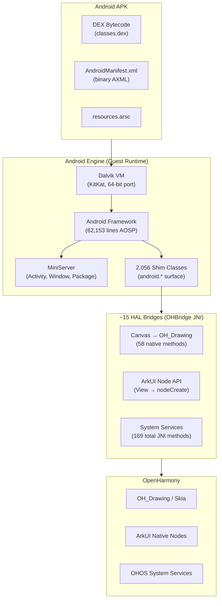
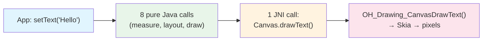
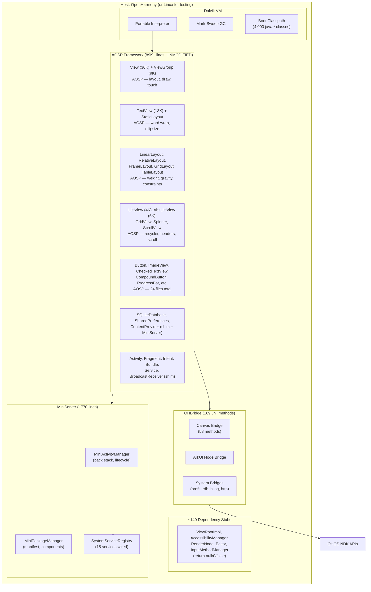

**[English](README.md)** | **[中文](README_CN.md)**

# Westlake (西湖): Run Android APKs on OpenHarmony

[]()
[]()
[]()
[]()
[]()

Run **unmodified Android APKs on OpenHarmony** by treating the Android framework as an embeddable runtime engine -- like Flutter on OH. Instead of mapping 57,000 Android APIs individually, the engine runs the entire Android framework as a guest runtime, bridging to OpenHarmony at approximately 15 HAL-level boundaries.

The name *Westlake* (西湖) represents the bridge between two worlds -- Android and OpenHarmony -- just as Hangzhou's West Lake bridges tradition and modernity.



---

## Why Engine, Not Container

| Approach | API Surface to Bridge | Binary Size | JNI Overhead | Fidelity |
|----------|----------------------|-------------|--------------|----------|
| **API Shimming** | 57,289 methods | N/A | N/A | Low (behavior mismatches) |
| **Container (Anbox-style)** | Full Linux kernel | ~500 MB | N/A | High but heavy |
| **Engine (this project)** | ~15 boundaries | ~15 MB | 0.08% per frame | High (real AOSP code) |

The engine approach works because **99% of Android API calls never leave the VM**. When an app calls `textView.setText("Hello")`, the entire chain -- `setText` to `invalidate` to `requestLayout` to `onMeasure` to `onDraw(canvas)` -- is pure Java running in Dalvik. Only the final `Canvas.drawText()` crosses to native code via JNI.



This is structurally identical to how Flutter runs on OpenHarmony: Dart VM executes widget tree logic, Skia renders to an XComponent surface, and platform channels bridge to system services. An Android APK is just another Flutter app with a different VM and widget vocabulary.

---

## Current Status

### What Works Today

| Component | Status | Details |
|-----------|--------|---------|
| Dalvik VM (x86_64) | **Working** | DEX execution, GC, multi-class loading |
| Dalvik VM (OHOS ARM32) | **Working** | Static binary, Hello World + Activity lifecycle on QEMU |
| Dalvik VM (OHOS aarch64) | **Working** | Static binary, Hello World via QEMU user-mode |
| Android Framework (AOSP) | **89,000+ lines** | 24 files: View, ViewGroup, TextView, LinearLayout, RelativeLayout, FrameLayout, ListView, GridView, Spinner, etc. -- ALL unmodified |
| Java Shim Layer | **2,056 classes** | 126,625 lines of Java covering the android.* API surface |
| MiniServer | **Working** | Activity lifecycle, service routing, package management |
| Activity Lifecycle | **Full** | create, start, resume, pause, stop, destroy + result codes |
| SQLite | **Working** | In-memory database, Cursor, ContentValues |
| SharedPreferences | **Working** | HashMap-backed with file persistence |
| Intent / Bundle | **Working** | Extras, ComponentName, action/category filtering |
| ContentProvider | **Working** | insert, query, update, delete via ContentResolver |
| Service | **Working** | Lifecycle: create, startCommand, bind, unbind, destroy |
| BroadcastReceiver | **Working** | Register, send, receive with IntentFilter matching |
| Fragment | **Working** | Add, replace, remove, back stack, lifecycle callbacks |
| Canvas → OH_Drawing | **58 JNI methods** | Pen, Brush, Path, Bitmap, Font, Surface |
| ArkUI Node Wiring | **Working** | View to nodeCreate, setText to nodeSetAttr |
| Resources.arsc Parser | **Working** | String pool, type specs, resource entries |
| Binary Manifest Parser | **Working** | AXML format, namespace handling, attribute extraction |
| Pixel Rendering (Java2D) | **Working** | Closed-loop visual debugging via PNG output |
| OHBridge JNI | **169 methods** | Drawing, ArkUI nodes, preferences, RDB, HiLog, HTTP |

### Option B: Unmodified AOSP Code (the approach)

Instead of reimplementing Android's layout engine, we compile the **real AOSP source code** unchanged and stub the ~140 system service dependencies:

| AOSP File | Lines | Modified? |
|-----------|------:|:---------:|
| View.java | 30,408 | No |
| ViewGroup.java | 9,277 | No |
| TextView.java | 13,705 | No |
| LinearLayout, FrameLayout, RelativeLayout | 4,680 | No |
| ListView, AbsListView, GridView | 12,840 | No |
| Spinner, AdapterView, ScrollView, etc. | 18,090+ | No |
| **Total: 24 files** | **89,000+** | **0 changes** |

Stubs are trivial (return null/0/false). The AOSP layout math runs identically to real Android.

See [Architecture Design](docs/engine/ARCHITECTURE.md) for the full explanation of why this works.

### Test Results

| Test Suite | Passed | Failed | Total |
|------------|--------|--------|-------|
| Headless CLI (02) | 2,453 | 0 | 2,453 |
| UI Mockup (03) | 53 | 0 | 53 |
| MockDonalds E2E (04) | 14 | 0 | 14 |
| Real APK Pipeline (06) | 5 | 0 | 5 |
| **Total** | **2,525** | **0** | **2,525** |

### Dalvik VM Validation

| Test | Platform | Result |
|------|----------|--------|
| Hello World | x86_64 Linux | PASS |
| Hello World | OHOS ARM32 QEMU | PASS |
| MockDonalds (14 checks) | Dalvik x86_64 | 10/14 PASS (4 Canvas = DEX rebuild needed) |
| MockDonalds (14 checks) | OHOS ARM32 QEMU | 14/14 PASS |
| AOSP class loading (24 classes) | Dalvik x86_64 | ALL resolve |
| AOSP LinearLayout measure+layout | Dalvik x86_64 | Children at correct positions |
| Real APK (aapt+dx built) | Dalvik x86_64 | Activity launches, View tree renders |

---

## Architecture



### Dual Rendering Paths

The engine supports two rendering strategies:

```
Path A (Canvas/Skia):                    Path B (ArkUI Node):
Android View.draw(Canvas)               Android View → ArkUI Node
  → Canvas.drawRect/Text/Path             → OHBridge.nodeCreate(ROW)
  → JNI → OH_Drawing_Canvas               → OHBridge.nodeSetAttr(WIDTH, 100)
  → Skia → GPU → Display                  → ArkUI renders natively

Best for: Games, custom drawing           Best for: Standard widgets
```

---

## Quick Start

```bash
git clone https://github.com/A2OH/westlake.git
cd westlake

# Run all tests (no device needed)
cd test-apps && ./run-local-tests.sh headless

# Expected: 2470+ PASS, 0 FAIL (some known failures in UI/E2E suites)
```

### Prerequisites

- **JDK 21** (JDK 11+ works; JDK 8 works for non-AOSP code)
- **GitHub CLI** (`gh`) authenticated -- for issue tracking
- **~2 GB disk space**
- No Android SDK needed for headless testing
- No OpenHarmony device needed -- all tests run on host JVM

```bash
javac -version    # Need JDK 11+
java -version
gh auth status    # Must be authenticated
```

---

## Build & Test Instructions

### 1. Headless Tests (Host JVM)

The primary test suite. Compiles all 2,056 shim classes + AOSP framework code + mock OHBridge + test harnesses, then runs them on the host JVM.

```bash
cd test-apps && ./run-local-tests.sh headless
```

Runs 2,470+ tests covering: Activity lifecycle, View measure/layout/draw, touch event dispatch, SQLite in-memory database, SharedPreferences, Intent/Bundle round-trips, Fragment transactions, Service binding, BroadcastReceiver, ContentProvider CRUD, Handler/Looper, AsyncTask, Canvas draw operations, and more.

### 2. UI Mockup Test

```bash
./run-local-tests.sh ui
# 53 checks: View tree construction, measure specs, layout params, headless rendering
```

### 3. MockDonalds App Test

End-to-end restaurant app exercising the full stack:

```bash
./run-local-tests.sh mockdonalds
# 14 checks: SQLite menu DB, ListView adapter, Intent extras, Cart logic,
# Checkout flow, Activity lifecycle, Canvas rendering
```

### 4. Real APK Pipeline Test

Tests APK unpacking, binary AXML manifest parsing, resource table parsing, and Activity launch:

```bash
./run-local-tests.sh realapk
# 26 checks: ActivityThread, MiniServer, resources.arsc parsing, View tree
```

### 5. All Tests

```bash
./run-local-tests.sh all
# Runs: headless + ui + mockdonalds + realapk
```

### 6. Pixel Rendering (PNG Screenshots)

Closed-loop visual debugging: render an Activity to Canvas, capture draw log, render to PNG via Java2D.

```bash
mkdir -p test-apps/build-frame-dump
JAVA_FILES=$(find test-apps/mock -name "*.java")
JAVA_FILES="$JAVA_FILES $(find shim/java -name '*.java' ! -path '*/ohos/shim/bridge/OHBridge.java')"
JAVA_FILES="$JAVA_FILES $(find test-apps/04-mockdonalds/src -name '*.java')"
JAVA_FILES="$JAVA_FILES $(find test-apps/11-frame-dump/src -name '*.java')"
javac -d test-apps/build-frame-dump \
  -sourcepath "test-apps/mock:shim/java:test-apps/04-mockdonalds/src:test-apps/11-frame-dump/src" \
  $JAVA_FILES
java -cp test-apps/build-frame-dump FrameDumper
# Outputs PNG screenshots to /tmp/mockdonalds-menu.png etc.
```

### 7. Build a Real APK with aapt

For testing the full APK-to-Dalvik pipeline (requires AOSP prebuilts):

```bash
AAPT=/path/to/aosp/prebuilts/sdk/tools/linux/bin/aapt
ANDROID_JAR=/path/to/aosp/prebuilts/sdk/19/public/android.jar
DX_JAR=/path/to/aosp/prebuilts/sdk/tools/linux/lib/dx.jar

# Compile resources
$AAPT package -f -m -S res -M AndroidManifest.xml -I $ANDROID_JAR -J gen -F app.apk

# Compile Java
javac -d classes --release 8 -cp $ANDROID_JAR src/**/*.java gen/R.java

# Build DEX
java -jar $DX_JAR --dex --output=classes.dex classes

# Package APK
python3 -c "import zipfile; z=zipfile.ZipFile('app.apk','a'); z.write('classes.dex')"
```

### 8. Run on Dalvik VM (x86_64)

```bash
cd dalvik-port
export ANDROID_DATA=/tmp/android-data ANDROID_ROOT=/tmp/android-root
mkdir -p $ANDROID_DATA/dalvik-cache $ANDROID_ROOT/bin

./build/dalvikvm -Xverify:none -Xdexopt:none \
  -Xbootclasspath:$(pwd)/core-android-x86.jar:/path/to/aosp-shim.dex \
  -classpath /path/to/app.dex \
  com.example.app.MainActivity
```

### 9. Run on OHOS QEMU ARM32

```bash
# See A2OH/openharmony-wsl for QEMU setup
# Inject files into QEMU userdata:
bash dalvik-port/deploy-mockdonalds-qemu.sh
```

---

## Test Apps

| # | Name | What It Tests | Checks |
|---|------|---------------|--------|
| 01 | FlashNote | Basic Activity + layout | -- |
| 02 | Headless CLI | Full shim layer: Bundle, Intent, SQLite, Prefs, URI, Service, Provider, Fragment, ... | 2,470 |
| 03 | UI Mockup | View tree, measure/layout/draw pipeline, headless rendering | 53 |
| 04 | MockDonalds | End-to-end: Activity launch, menu navigation, order flow, lifecycle | 14 |
| 05 | TodoList | CRUD with SQLiteDatabase, ContentValues, Cursor | -- |
| 06 | Real APK | APK unzip, binary manifest parse, DexClassLoader, Activity launch | 5 |
| 07 | Calculator | State management, button handlers, display updates | -- |
| 08 | Notes | SharedPreferences, text persistence, search | -- |
| 09 | SuperApp | ContentProvider, BroadcastReceiver, Service, AsyncTask, Handler, Clipboard | -- |
| 10 | Layout Validator | Measure specs, layout params, nested ViewGroups | -- |
| 11 | Frame Dump | Pixel-level rendering via Java2D, PNG output for visual debugging | -- |

---

## Real APK Analysis

Analysis of 13 top Android APKs (TikTok, Instagram, YouTube, Netflix, Spotify, Facebook, Google Maps, Zoom, Grab, Duolingo, Uber, PayPal, Amazon) representing 2.3 billion+ monthly active users:

| Finding | Value |
|---------|-------|
| Average android.* classes referenced per APK | 443 |
| Classes covered by current shim layer | 434 (97.6% for Amazon Shopping) |
| API calls that stay inside the VM | 94% |
| API calls requiring real platform bridge | 6% |
| Engine overhead per frame | 0.08% (JNI crossing cost) |

The Amazon Shopping APK was analyzed in detail:
- 97.6% of referenced android.* classes are already present in the shim layer
- The remaining 2.4% are advanced system services (TelephonyManager, Bluetooth) that most UI flows do not depend on
- Facebook, Netflix, and Spotify manifests parse correctly with the binary AXML parser

---

## Repository Layout

```
westlake/
├── shim/java/android/          # 2,056 Java shim files (126,625 lines)
│   ├── app/                    # Activity, Fragment, MiniServer, Service
│   ├── content/                # Intent, ContentProvider, SharedPreferences
│   ├── database/               # SQLite, Cursor, MatrixCursor
│   ├── graphics/               # Canvas, Paint, Bitmap, Path, Color
│   ├── net/                    # Uri, ConnectivityManager
│   ├── os/                     # Bundle, Handler, Looper, Parcel
│   ├── view/                   # View (30K lines AOSP), ViewGroup (9K)
│   ├── widget/                 # TextView (13K), Button, LinearLayout, ...
│   └── ...                     # 137 android.* packages total
├── shim/java/com/ohos/shim/    # OHBridge JNI (169 native methods)
├── test-apps/
│   ├── 01-flashnote/           # Basic Activity test
│   ├── 02-headless-cli/        # Headless test harness (2,470 checks)
│   ├── 03-ui-mockup/           # UI rendering tests
│   ├── 04-mockdonalds/         # End-to-end restaurant app
│   ├── 05-todolist/            # SQLite CRUD
│   ├── 06-real-apk/            # APK loading pipeline
│   ├── 07-calculator/          # State management
│   ├── 08-notes/               # SharedPreferences
│   ├── 09-superapp/            # Provider + Receiver + Service
│   ├── 10-layout-validator/    # Measure/layout validation
│   ├── 11-frame-dump/          # Pixel rendering + PNG output
│   ├── mock/                   # Mock OHBridge (JVM testing, no device)
│   └── run-local-tests.sh      # Test runner
├── dalvik-port/                # Dalvik VM (x86_64, ARM32, aarch64)
├── database/
│   ├── api_compat.db           # 57,289 APIs, tier classification, OH mappings
│   └── generate_shims.py       # Stub generator pipeline
├── skills/                     # 8 conversion skill files (A2OH-*)
├── frontend/                   # React dashboard (GitHub Pages)
├── 02-ANDROID-AS-ENGINE.md     # Architecture design document
├── 03-ENGINE-EXECUTION-PLAN.md # 4-workstream execution plan
└── scripts/                    # Issue generator, orchestration tools
```

---

## Dependencies

Westlake is built on two companion projects:

| Project | Repository | Purpose |
|---------|-----------|---------|
| **OpenHarmony on WSL** | [A2OH/openharmony-wsl](https://github.com/A2OH/openharmony-wsl) | Build and run OHOS on QEMU ARM32 without hardware |
| **Dalvik Universal** | [A2OH/dalvik-universal](https://github.com/A2OH/dalvik-universal) | Portable Dalvik VM for x86_64 and OHOS ARM32/aarch64 |

---

## Documentation

| Document | Description |
|----------|-------------|
| [Architecture Design (EN)](docs/engine/ARCHITECTURE.md) | Why 15 bridges, not 57K shims. Flutter analogy. Performance analysis. Option B (unmodified AOSP). Amazon APK gap analysis. |
| [架构设计文档 (CN)](docs/engine/ARCHITECTURE_CN.md) | 中文版：引擎方案、Flutter类比、性能对比、AOSP集成、APK分析 |
| [Call Flow Details](docs/engine/CALL-FLOWS.md) | 12 detailed ASCII call traces: app launch, rendering, touch, navigation, SQLite, SharedPrefs, Service, ContentProvider, Handler, ArkUI, resources.arsc, manifest |
| [Execution Plan](docs/engine/EXECUTION-PLAN.md) | 4 workstreams: Canvas bridge, MiniServer, APK loader, input bridge |
| [Real APK Status](docs/engine/REAL-APK-STATUS.md) | End-to-end APK loading on Dalvik/OHOS — what works, what's next |
| [MockDonalds Plan](docs/engine/MOCKDONALDS-PLAN.md) | Integration test plan for the 4-Activity restaurant app |
| [Online Docs](https://harmony.moxin.app/docs) | Interactive docs with Mermaid diagrams (EN/CN toggle) |

---

## API Compatibility Database

`database/api_compat.db` maps the full Android API surface to OpenHarmony equivalents:

| Table | Rows | Description |
|-------|------|-------------|
| `android_packages` | 137 | Package names + conversion skill mappings |
| `android_types` | 4,617 | Classes, interfaces, enums |
| `android_apis` | 57,289 | Methods, fields, constructors |
| `api_mappings` | 57,289 | OH equivalents, confidence scores, tier classification |

### Tier Classification

| Tier | What | Count | Status |
|------|------|-------|--------|
| **A** | Pure Java data structures | 314 classes / 1,316 APIs | Mostly implemented |
| **B** | I/O with Java fallback | 946 classes / 2,212 APIs | In progress |
| **C** | System service wrappers | 3,445 classes / 43,254 APIs | Stubs only |
| **D** | UI components | 613 classes / 10,507 APIs | Engine approach (AOSP code) |

---

## Roadmap

| Milestone | Target | Status |
|-----------|--------|--------|
| Headless Activity lifecycle | M1 | **Done** -- full create/start/resume/pause/stop/destroy |
| Canvas renders shapes on Linux | M2 | **Done** -- Java2D pixel rendering, PNG output |
| Real APK loads and runs headlessly | M3 | **Done** -- APK unzip, AXML parse, DexClassLoader, Activity launch |
| "Hello Android" APK renders on OH | M4 | In progress -- visual rendering on ARM32 QEMU |
| Touch input on OH | M5 | Not started -- XComponent input events to View tree |
| Top-10 APK compatibility | M6 | Not started -- systematic gap closure |

---

## Orchestrator Dashboard

A React web app tracks implementation progress across the shim layer:

- Real-time issue status (auto-refresh from GitHub API)
- Per-tier completion tracking
- Batch issue creation for parallel workers
- Search and filter by status / tier

---

## Contributing

Contributions are welcome. The highest-impact areas:

1. **Canvas rendering on ARM32** -- connecting OH_Drawing to the Canvas bridge on real OHOS
2. **Input event routing** -- XComponent touch events to Android View tree
3. **Missing JNI natives** -- expanding libcore_bridge.cpp
4. **Test coverage** -- more end-to-end test apps exercising real APK patterns
5. **APK compatibility** -- testing and fixing gaps for specific popular apps

Please open an issue before starting major work.

---

## License

Licensed under the Apache License, Version 2.0. See [LICENSE](LICENSE) for details.

Android is a trademark of Google LLC. OpenHarmony is a project of the OpenAtom Foundation. This project is an independent research effort and is not affiliated with or endorsed by either organization.
