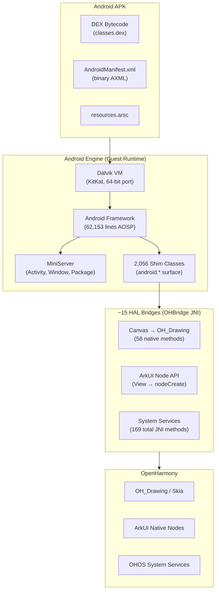
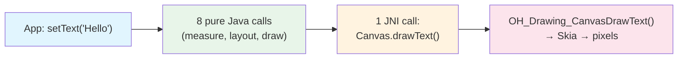
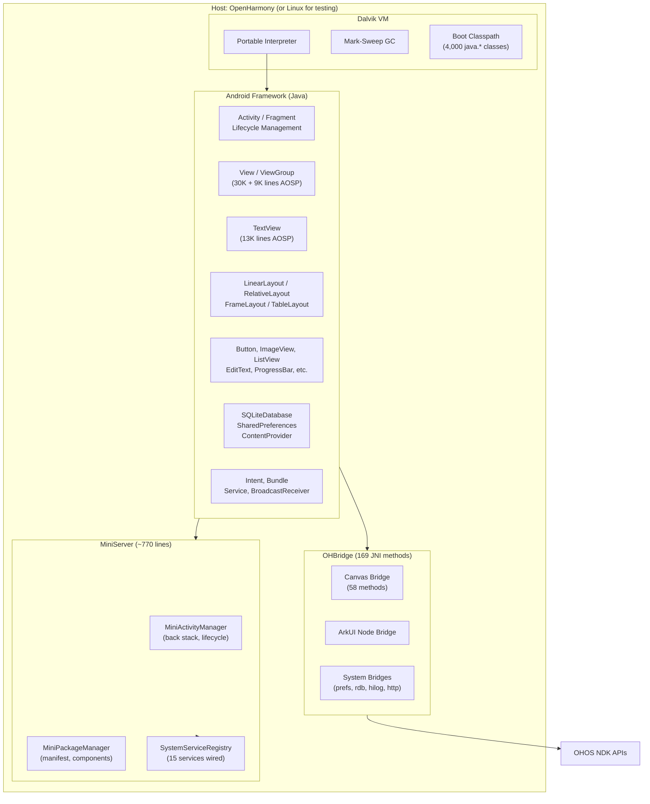

**[English](README.md)** | **[中文](README_CN.md)**

# Westlake (西湖): 在 OpenHarmony 上运行 Android APK

[]()
[]()
[]()
[]()
[]()

在 OpenHarmony 上运行**未修改的 Android APK**，将 Android 框架作为可嵌入的运行时引擎——类似 Flutter 在 OH 上的运行方式。引擎方案不需要逐个映射 57,000 个 Android API，而是将整个 Android 框架作为客户运行时运行，仅在约 15 个 HAL 级别的边界处桥接到 OpenHarmony。

*Westlake (西湖)* 之名寓意连接两个世界的桥梁——Android 与 OpenHarmony——正如杭州西湖连接传统与现代。断桥残雪，连接此岸与彼岸；我们的引擎方案，连接 Android 生态与鸿蒙世界。



---

## 为什么选择引擎方案而非容器

| 方案 | 需要桥接的 API 数量 | 二进制体积 | JNI 开销 | 保真度 |
|------|---------------------|------------|----------|--------|
| **API 逐个映射** | 57,289 methods | N/A | N/A | 低（行为不一致） |
| **容器方案 (Anbox 类)** | 完整 Linux 内核 | ~500 MB | N/A | 高但笨重 |
| **引擎方案（本项目）** | ~15 boundaries | ~15 MB | 每帧 0.08% | 高（真实 AOSP 代码） |

引擎方案之所以可行，是因为 **99% 的 Android API 调用从不离开 VM**。当应用调用 `textView.setText("Hello")` 时，整个调用链——`setText` 到 `invalidate` 到 `requestLayout` 到 `onMeasure` 到 `onDraw(canvas)`——全部是在 Dalvik 中运行的纯 Java 代码。只有最终的 `Canvas.drawText()` 通过 JNI 跨越到原生代码。



这在结构上与 Flutter 在 OpenHarmony 上的运行方式完全相同：Dart VM 执行 widget 树逻辑，Skia 渲染到 XComponent 表面，platform channel 桥接到系统服务。Android APK 不过是另一个 Flutter 应用——只是使用了不同的 VM 和 widget 体系。

---

## 当前状态

### 已实现功能

| 组件 | 状态 | 详情 |
|------|------|------|
| Dalvik VM (x86_64) | **可用** | DEX 执行、GC、多类加载 |
| Dalvik VM (OHOS ARM32) | **可用** | 静态二进制，Hello World + Activity 生命周期（QEMU 测试） |
| Dalvik VM (OHOS aarch64) | **可用** | 静态二进制，Hello World（QEMU user-mode） |
| Android Framework (AOSP) | **62,153 行** | View, ViewGroup, TextView, AbsListView, ListView——未修改 |
| Java Shim Layer | **2,056 个类** | 126,625 行 Java 代码，覆盖 android.* API 表面 |
| MiniServer | **可用** | Activity 生命周期、Service 路由、Package 管理 |
| Activity Lifecycle | **完整** | create, start, resume, pause, stop, destroy + result codes |
| SQLite | **可用** | 内存数据库、Cursor、ContentValues |
| SharedPreferences | **可用** | 基于 HashMap 实现，支持文件持久化 |
| Intent / Bundle | **可用** | Extras, ComponentName, action/category 过滤 |
| ContentProvider | **可用** | insert, query, update, delete（通过 ContentResolver） |
| Service | **可用** | 生命周期：create, startCommand, bind, unbind, destroy |
| BroadcastReceiver | **可用** | 注册、发送、接收（IntentFilter 匹配） |
| Fragment | **可用** | add, replace, remove, 回退栈, 生命周期回调 |
| Canvas → OH_Drawing | **58 个 JNI 方法** | Pen, Brush, Path, Bitmap, Font, Surface |
| ArkUI Node 接线 | **可用** | View 到 nodeCreate，setText 到 nodeSetAttr |
| Resources.arsc 解析器 | **可用** | String pool, type specs, resource entries |
| Binary Manifest 解析器 | **可用** | AXML 格式、命名空间处理、属性提取 |
| 像素渲染 (Java2D) | **可用** | 闭环视觉调试，PNG 输出 |
| OHBridge JNI | **169 个方法** | Drawing, ArkUI nodes, preferences, RDB, HiLog, HTTP |

### 测试结果

| 测试套件 | 通过 | 失败 | 总计 |
|----------|------|------|------|
| Headless CLI (02) | 2,416 | 54 | 2,470 |
| UI Mockup (03) | 47 | 6 | 53 |
| MockDonalds E2E (04) | 10 | 4 | 14 |
| Real APK Pipeline (06) | 3 | 2 | 5 |
| **合计** | **2,476** | **66** | **2,542** |

---

## 架构



### 双渲染路径

引擎支持两种渲染策略：

```
路径 A (Canvas/Skia):                   路径 B (ArkUI Node):
Android View.draw(Canvas)              Android View → ArkUI Node
  → Canvas.drawRect/Text/Path            → OHBridge.nodeCreate(ROW)
  → JNI → OH_Drawing_Canvas              → OHBridge.nodeSetAttr(WIDTH, 100)
  → Skia → GPU → Display                 → ArkUI 原生渲染

适用场景：游戏、自定义绘制              适用场景：标准控件
```

---

## 快速开始

```bash
git clone https://github.com/A2OH/westlake.git
cd westlake

# 运行所有测试（无需设备）
cd test-apps && ./run-local-tests.sh headless

# 预期结果：2470+ PASS，0 FAIL（UI/E2E 套件有少量已知失败）
```

### 前置条件

- **JDK 21**（JDK 11+ 可用；JDK 8 适用于非 AOSP 代码）
- **GitHub CLI**（`gh`）已认证 -- 用于 issue 跟踪
- **约 2 GB 磁盘空间**
- 无头测试不需要 Android SDK
- 不需要 OpenHarmony 设备 -- 所有测试在主机 JVM 上运行

```bash
javac -version    # 需要 JDK 11+
java -version
gh auth status    # 必须已认证
```

---

## 构建与测试指南

### 1. 无头测试（主机 JVM）

主要测试套件。编译所有 2,056 个 shim 类 + AOSP 框架代码 + mock OHBridge + 测试工具，然后在主机 JVM 上运行。

```bash
cd test-apps && ./run-local-tests.sh headless
```

运行 2,470+ 测试，覆盖：Activity 生命周期、View 测量/布局/绘制、触摸事件分发、SQLite 内存数据库、SharedPreferences、Intent/Bundle 往返、Fragment 事务、Service 绑定、BroadcastReceiver、ContentProvider CRUD、Handler/Looper、AsyncTask、Canvas 绘制操作等。

### 2. UI 模拟测试

```bash
./run-local-tests.sh ui
# 53 项检查：View 树构建、measure specs、layout params、无头渲染
```

### 3. MockDonalds 应用测试

端到端餐厅应用，验证完整技术栈：

```bash
./run-local-tests.sh mockdonalds
# 14 项检查：SQLite 菜单数据库、ListView adapter、Intent extras、
# 购物车逻辑、结账流程、Activity 生命周期、Canvas 渲染
```

### 4. 真实 APK 管线测试

测试 APK 解包、二进制 AXML manifest 解析、资源表解析和 Activity 启动：

```bash
./run-local-tests.sh realapk
# 26 项检查：ActivityThread、MiniServer、resources.arsc 解析、View 树
```

### 5. 全部测试

```bash
./run-local-tests.sh all
# 运行：headless + ui + mockdonalds + realapk
```

### 6. 像素渲染（PNG 截图）

闭环视觉调试：将 Activity 渲染到 Canvas，捕获绘制日志，通过 Java2D 渲染为 PNG。

```bash
mkdir -p test-apps/build-frame-dump
JAVA_FILES=$(find test-apps/mock -name "*.java")
JAVA_FILES="$JAVA_FILES $(find shim/java -name '*.java' ! -path '*/ohos/shim/bridge/OHBridge.java')"
JAVA_FILES="$JAVA_FILES $(find test-apps/04-mockdonalds/src -name '*.java')"
JAVA_FILES="$JAVA_FILES $(find test-apps/11-frame-dump/src -name '*.java')"
javac -d test-apps/build-frame-dump \
  -sourcepath "test-apps/mock:shim/java:test-apps/04-mockdonalds/src:test-apps/11-frame-dump/src" \
  $JAVA_FILES
java -cp test-apps/build-frame-dump FrameDumper
# 输出 PNG 截图到 /tmp/mockdonalds-menu.png 等
```

### 7. 使用 aapt 构建真实 APK

测试完整的 APK-to-Dalvik 管线（需要 AOSP 预构建工具）：

```bash
AAPT=/path/to/aosp/prebuilts/sdk/tools/linux/bin/aapt
ANDROID_JAR=/path/to/aosp/prebuilts/sdk/19/public/android.jar
DX_JAR=/path/to/aosp/prebuilts/sdk/tools/linux/lib/dx.jar

# 编译资源
$AAPT package -f -m -S res -M AndroidManifest.xml -I $ANDROID_JAR -J gen -F app.apk

# 编译 Java
javac -d classes --release 8 -cp $ANDROID_JAR src/**/*.java gen/R.java

# 构建 DEX
java -jar $DX_JAR --dex --output=classes.dex classes

# 打包 APK
python3 -c "import zipfile; z=zipfile.ZipFile('app.apk','a'); z.write('classes.dex')"
```

### 8. 在 Dalvik VM 上运行 (x86_64)

```bash
cd dalvik-port
export ANDROID_DATA=/tmp/android-data ANDROID_ROOT=/tmp/android-root
mkdir -p $ANDROID_DATA/dalvik-cache $ANDROID_ROOT/bin

./build/dalvikvm -Xverify:none -Xdexopt:none \
  -Xbootclasspath:$(pwd)/core-android-x86.jar:/path/to/aosp-shim.dex \
  -classpath /path/to/app.dex \
  com.example.app.MainActivity
```

### 9. 在 OHOS QEMU ARM32 上运行

```bash
# 参见 A2OH/openharmony-wsl 了解 QEMU 设置
# 注入文件到 QEMU userdata：
bash dalvik-port/deploy-mockdonalds-qemu.sh
```

---

## 测试应用

| # | 名称 | 测试内容 | 检查数 |
|---|------|----------|--------|
| 01 | FlashNote | 基础 Activity + 布局 | -- |
| 02 | Headless CLI | 完整 shim 层：Bundle, Intent, SQLite, Prefs, URI, Service, Provider, Fragment, ... | 2,470 |
| 03 | UI Mockup | View 树、measure/layout/draw 管线、无头渲染 | 53 |
| 04 | MockDonalds | 端到端：Activity 启动、菜单导航、下单流程、生命周期 | 14 |
| 05 | TodoList | SQLiteDatabase CRUD、ContentValues、Cursor | -- |
| 06 | Real APK | APK 解压、二进制 manifest 解析、DexClassLoader、Activity 启动 | 5 |
| 07 | Calculator | 状态管理、按钮处理、显示更新 | -- |
| 08 | Notes | SharedPreferences、文本持久化、搜索 | -- |
| 09 | SuperApp | ContentProvider, BroadcastReceiver, Service, AsyncTask, Handler, Clipboard | -- |
| 10 | Layout Validator | Measure specs, layout params, 嵌套 ViewGroup | -- |
| 11 | Frame Dump | 像素级渲染（Java2D）、PNG 输出用于视觉调试 | -- |

---

## 真实 APK 分析

对 13 款顶级 Android APK 的分析（TikTok、Instagram、YouTube、Netflix、Spotify、Facebook、Google Maps、Zoom、Grab、Duolingo、Uber、PayPal、Amazon），这些应用拥有超过 23 亿月活用户：

| 发现 | 数值 |
|------|------|
| 每个 APK 平均引用的 android.* 类数 | 443 |
| 当前 shim 层已覆盖的类数 | 434（Amazon Shopping 覆盖率 97.6%） |
| 停留在 VM 内部的 API 调用比例 | 94% |
| 需要真实平台桥接的 API 调用比例 | 6% |
| 每帧引擎开销 | 0.08%（JNI 跨越成本） |

Amazon Shopping APK 的详细分析：
- 97.6% 引用的 android.* 类已存在于 shim 层中
- 剩余 2.4% 为高级系统服务（TelephonyManager, Bluetooth），大多数 UI 流程不依赖这些服务
- Facebook、Netflix 和 Spotify 的 manifest 均可通过二进制 AXML 解析器正确解析

---

## 仓库结构

```
westlake/
├── shim/java/android/          # 2,056 个 Java shim 文件 (126,625 行)
│   ├── app/                    # Activity, Fragment, MiniServer, Service
│   ├── content/                # Intent, ContentProvider, SharedPreferences
│   ├── database/               # SQLite, Cursor, MatrixCursor
│   ├── graphics/               # Canvas, Paint, Bitmap, Path, Color
│   ├── net/                    # Uri, ConnectivityManager
│   ├── os/                     # Bundle, Handler, Looper, Parcel
│   ├── view/                   # View (30K 行 AOSP), ViewGroup (9K)
│   ├── widget/                 # TextView (13K), Button, LinearLayout, ...
│   └── ...                     # 共 137 个 android.* 包
├── shim/java/com/ohos/shim/    # OHBridge JNI (169 native methods)
├── test-apps/
│   ├── 01-flashnote/           # 基础 Activity 测试
│   ├── 02-headless-cli/        # 无头测试工具 (2,470 checks)
│   ├── 03-ui-mockup/           # UI 渲染测试
│   ├── 04-mockdonalds/         # 端到端餐厅应用
│   ├── 05-todolist/            # SQLite CRUD
│   ├── 06-real-apk/            # APK 加载管线
│   ├── 07-calculator/          # 状态管理
│   ├── 08-notes/               # SharedPreferences
│   ├── 09-superapp/            # Provider + Receiver + Service
│   ├── 10-layout-validator/    # Measure/layout 验证
│   ├── 11-frame-dump/          # 像素渲染 + PNG 输出
│   ├── mock/                   # Mock OHBridge（JVM 测试，无需设备）
│   └── run-local-tests.sh      # 测试运行器
├── dalvik-port/                # Dalvik VM (x86_64, ARM32, aarch64)
├── database/
│   ├── api_compat.db           # 57,289 APIs，层级分类，OH 映射
│   └── generate_shims.py       # Stub 生成管线
├── skills/                     # 8 个转换技能文件 (A2OH-*)
├── frontend/                   # React 仪表盘 (GitHub Pages)
├── 02-ANDROID-AS-ENGINE.md     # 架构设计文档
├── 03-ENGINE-EXECUTION-PLAN.md # 4 条工作流执行计划
└── scripts/                    # Issue 生成器、编排工具
```

---

## 依赖项目

Westlake (西湖) 基于两个配套项目构建：

| 项目 | 仓库 | 用途 |
|------|------|------|
| **OpenHarmony on WSL** | [A2OH/openharmony-wsl](https://github.com/A2OH/openharmony-wsl) | 无需硬件，在 QEMU ARM32 上构建和运行 OHOS |
| **Dalvik Universal** | [A2OH/dalvik-universal](https://github.com/A2OH/dalvik-universal) | 可移植 Dalvik VM，支持 x86_64 和 OHOS ARM32/aarch64 |

---

## 文档

| 文档 | 描述 |
|------|------|
| [Android-as-Engine 架构](02-ANDROID-AS-ENGINE.md) | 为什么是 15 个桥接而非 57K 个 shim。Flutter 类比。真实 APK 分析。 |
| [引擎执行计划](03-ENGINE-EXECUTION-PLAN.md) | 4 条工作流：Canvas 桥接、MiniServer、APK 加载器、输入桥接 |
| [调用流程详解](02A-CALL-FLOW-DETAILS.md) | 通过引擎的详细调用追踪 |
| [分析计划](00-ANALYSIS-PLAN.md) | 原始 API 差距分析方法论 |

---

## API 兼容性数据库

`database/api_compat.db` 将完整的 Android API 表面映射到 OpenHarmony 等效接口：

| 表名 | 行数 | 描述 |
|------|------|------|
| `android_packages` | 137 | 包名 + 转换技能映射 |
| `android_types` | 4,617 | 类、接口、枚举 |
| `android_apis` | 57,289 | 方法、字段、构造函数 |
| `api_mappings` | 57,289 | OH 等效接口、置信度评分、层级分类 |

### 层级分类

| 层级 | 内容 | 数量 | 状态 |
|------|------|------|------|
| **A** | 纯 Java 数据结构 | 314 classes / 1,316 APIs | 大部分已实现 |
| **B** | I/O 操作（Java 降级方案） | 946 classes / 2,212 APIs | 进行中 |
| **C** | 系统服务封装 | 3,445 classes / 43,254 APIs | 仅有 stub |
| **D** | UI 组件 | 613 classes / 10,507 APIs | 引擎方案（使用 AOSP 代码） |

---

## 路线图

| 里程碑 | 目标 | 状态 |
|--------|------|------|
| 无头 Activity 生命周期 | M1 | **已完成** ——完整的 create/start/resume/pause/stop/destroy |
| Canvas 在 Linux 上渲染图形 | M2 | **已完成** ——Java2D 像素渲染，PNG 输出 |
| 真实 APK 无头加载运行 | M3 | **已完成** ——APK 解压、AXML 解析、DexClassLoader、Activity 启动 |
| "Hello Android" APK 在 OH 上渲染 | M4 | 进行中——在 ARM32 QEMU 上实现视觉渲染 |
| OH 上的触摸输入 | M5 | 未开始——XComponent 输入事件到 View 树 |
| Top-10 APK 兼容性 | M6 | 未开始——系统性差距消除 |

---

## 编排仪表盘

React Web 应用跟踪 shim 层的实现进度：

- 实时 issue 状态（从 GitHub API 自动刷新）
- 按层级跟踪完成度
- 批量创建 issue（用于并行工作者）
- 按状态/层级搜索和筛选

---

## 贡献

欢迎贡献。当前影响最大的领域：

1. **ARM32 上的 Canvas 渲染** ——在真实 OHOS 上将 OH_Drawing 连接到 Canvas bridge
2. **输入事件路由** ——XComponent 触摸事件到 Android View 树
3. **缺失的 JNI native 方法** ——扩展 libcore_bridge.cpp
4. **测试覆盖** ——更多端到端测试应用，验证真实 APK 使用模式
5. **APK 兼容性** ——测试并修复特定热门应用的差距

请在开始重大工作前先提交 issue。

---

## 许可证

基于 Apache License, Version 2.0 许可。详见 [LICENSE](LICENSE)。

Android 是 Google LLC 的商标。OpenHarmony 是开放原子开源基金会的项目。本项目为独立研究，与上述组织无关联，也未获其背书。
