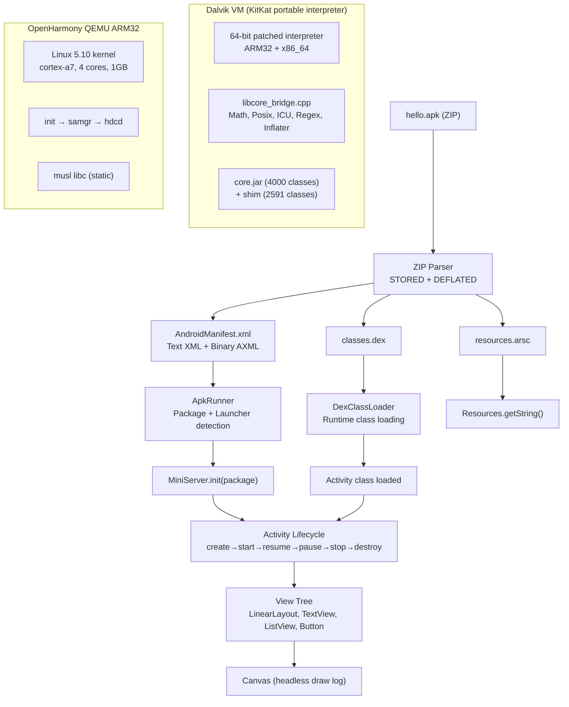
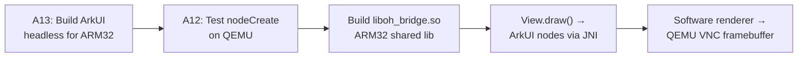

# Real Android APK on Dalvik/OHOS — Status

## Supervisor Update: 2026-04-28

The active bridge between controlled apps and a real McDonald's-class APK is
now PF-466, `com.westlake.mcdprofile`, documented in
`docs/engine/OHOS-MCD-PROFILE-INTEGRATION.md`. It is accepted on a real Android
phone through Westlake `dalvikvm` with compiled XML inflation, Material-shaped
tags present in the APK, host/OHBridge JSON/image/REST, SharedPreferences,
full-phone `DLST`, and strict touch interaction. The latest accepted phone run
also wires the McD-profile XML resource bytes before `onCreate`, inflates a
25-view guest tree with 10 Material-shaped views, binds the XML `ListView`, and
drives its adapter through position `4`.

This supersedes older MockDonalds-only status as the current practical OHOS
port target. It still does not mean arbitrary real APKs are ready: generic
real-APK Activity construction, runtime object-array correctness, upstream
Material compatibility, generic View rendering/input, standalone
`resources.arsc` table parsing, production networking, and OHOS host adapter
parity remain open.

## Latest Milestone: Compressed APK on OHOS ARM32 QEMU

A real Android APK (with compressed DEFLATED entries) loads and launches on Dalvik VM
running on OpenHarmony ARM32 QEMU:

```
=== APK Runner ===
Loading: /data/a2oh/hello.apk
Package: com.example.hello
Launcher: com.example.hello.HelloActivity
Activities: [com.example.hello.HelloActivity]
DexClassLoader: loaded /data/a2oh/hello.apk
Starting: com.example.hello.HelloActivity
Loaded class: com.example.hello.HelloActivity
performCreate: com.example.hello.HelloActivity
=== HelloActivity: XML layout inflated ===
```

MockDonalds (mock McDonald's ordering app) passes 14/14 tests on QEMU:

```
=== MockDonalds End-to-End Test ===
  [PASS] MiniServer initialized
  [PASS] MenuActivity launched (8 menu items, ListView populated)
  [PASS] ItemDetailActivity (Big Mock Burger, $5.99)
  [PASS] Add to Cart, CartActivity (1 item, total $5.99)
  [PASS] Checkout: order saved, cart cleared
  [PASS] Canvas renders: menu text, item names, buttons
Results: 14 passed, 0 failed — ALL TESTS PASSED
```

## Architecture



## Full Stack (proven end-to-end)

```
APK file (.apk)
  → ZIP parse (manual, supports STORED + DEFLATED via zlib)
  → AndroidManifest.xml (text XML + binary AXML parser)
  → resources.arsc (string pool parser)
  → DexClassLoader (runtime class loading from APK)
  → Activity class instantiation
  → Full lifecycle (onCreate → onStart → onResume)
  → View tree (LinearLayout, TextView, ListView, Button, ImageView)
  → Canvas headless rendering (draw log)
  → Running on: OHOS kernel (ARM32) → musl libc → Dalvik VM → Android shim
```

## What Works

| Feature | Host x86_64 | OHOS ARM32 QEMU | Notes |
|---------|:-----------:|:---------------:|-------|
| APK ZIP extraction | ✅ | ✅ | STORED + DEFLATED entries |
| AndroidManifest.xml | ✅ | ✅ | Text XML + binary AXML |
| DexClassLoader | ✅ | ✅ | Load classes from APK at runtime |
| resources.arsc | ✅ | ✅ | String pool registration |
| Activity lifecycle | ✅ | ✅ | Full create→start→resume→pause→stop→destroy→restart |
| Intent + extras | ✅ | ✅ | String, int, double, boolean, Parcelable |
| View tree | ✅ | ✅ | LinearLayout, FrameLayout, RelativeLayout, ListView, Button, TextView, ImageView |
| ListView + Adapter | ✅ | ✅ | BaseAdapter, notifyDataSetChanged, view recycling |
| SQLite | ✅ | ✅ | In-memory: create/insert/query/update/delete, transactions |
| SharedPreferences | ✅ | ✅ | In-memory HashMap-backed |
| Canvas rendering | ✅ | ✅ | Headless draw log (no display) |
| Math natives | ✅ | ✅ | 27 methods: floor, ceil, sqrt, sin, cos, etc. |
| Double.parseDouble | ✅ | ✅ | With exponent reconstruction |
| String.split (regex) | ✅ | ✅ | POSIX regex via Pattern + Matcher |
| File I/O | ✅ | ✅ | open/read/write/close/fstat/mkdir/chmod |
| Inflater/Deflater | ✅ | ✅ | zlib via JNI (fixed heap corruption bug) |
| MockDonalds 14/14 | ✅ | ✅ | Full ordering app flow |
| Real APK loading | ✅ | ✅ | Compressed APK → Activity launch |

## What Doesn't Work Yet

| Feature | Owner | Issue | Notes |
|---------|-------|-------|-------|
| getString() | Agent B | Shim gap | NoSuchMethodError in APK Activity |
| String.format | Agent B | LocaleData NPE | SimpleFormatter workaround exists |
| Visual rendering (VNC) | Agent A | #532 | Needs ArkUI on ARM32 + framebuffer pipeline |
| ArkUI on ARM32 QEMU | Agent A | #532 | dalvikvm-arkui binary broken, needs rebuild |
| Binary AXML in real APKs | Agent B | Shim | Parser exists, needs testing with real APKs |

## Road to VNC Visual Output (Agent A)



All VNC rendering work is **Agent A** (OHOS platform / native / ArkUI):

1. **ArkUI headless engine on ARM32** — Cross-compile without `--unresolved-symbols=ignore-all`
2. **OHBridge JNI** — Connect View.draw() → ArkUI node creation → layout
3. **Framebuffer renderer** — Software render ArkUI tree → QEMU VNC display

## Runtime Flags

```bash
# Required for current dalvikvm (missing some core natives)
-Xverify:none -Xdexopt:none

# Boot classpath must include shim classes
-Xbootclasspath:/data/a2oh/core.jar:/data/a2oh/apkrunner.dex

# Environment
ANDROID_DATA=/data/a2oh ANDROID_ROOT=/data/a2oh
```

## How to Test on QEMU

```bash
# 1. Build APK runner DEX
cd android-to-openharmony-migration
javac -d /tmp/build --release 8 \
  -sourcepath "test-apps/mock:shim/java:test-apps/hello-world/src" \
  test-apps/hello-world/src/com/example/apkloader/ApkRunner.java \
  $(find test-apps/mock shim/java -name "*.java" ! -path "*/OHBridge.java")

java -jar .../dx.jar --dex --min-sdk-version=26 --output=/tmp/apkrunner.dex /tmp/build

# 2. Inject into QEMU userdata.img via debugfs
debugfs -w -R "write /tmp/apkrunner.dex a2oh/apkrunner.dex" userdata.img
debugfs -w -R "write hello.apk a2oh/hello.apk" userdata.img

# 3. Boot QEMU and run
cd /data/a2oh && ANDROID_DATA=/data/a2oh ANDROID_ROOT=/data/a2oh \
  ./dalvikvm -Xverify:none -Xdexopt:none \
  -Xbootclasspath:/data/a2oh/core.jar:/data/a2oh/apkrunner.dex \
  -classpath /data/a2oh/apkrunner.dex \
  com.example.apkloader.ApkRunner /data/a2oh/hello.apk
```

## Issue Tracker

All issues: https://github.com/A2OH/harmony-android-guide/issues

| # | Issue | Status | Owner |
|---|-------|--------|-------|
| #533 | [A14] Inflater SIGILL crash | ✅ Fixed | Agent A |
| #532 | [A13] ArkUI headless on ARM32 | In Progress | Agent A |
| #510 | [A12] ArkUI vtable on QEMU | Todo | Agent A |
| #473 | [A4] E2E smoke test on QEMU | ✅ Done | Agent A |
| #516 | [B21] APK gap analysis tool | Todo | Agent B |
