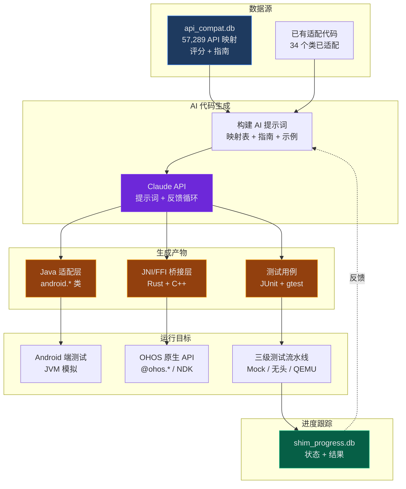
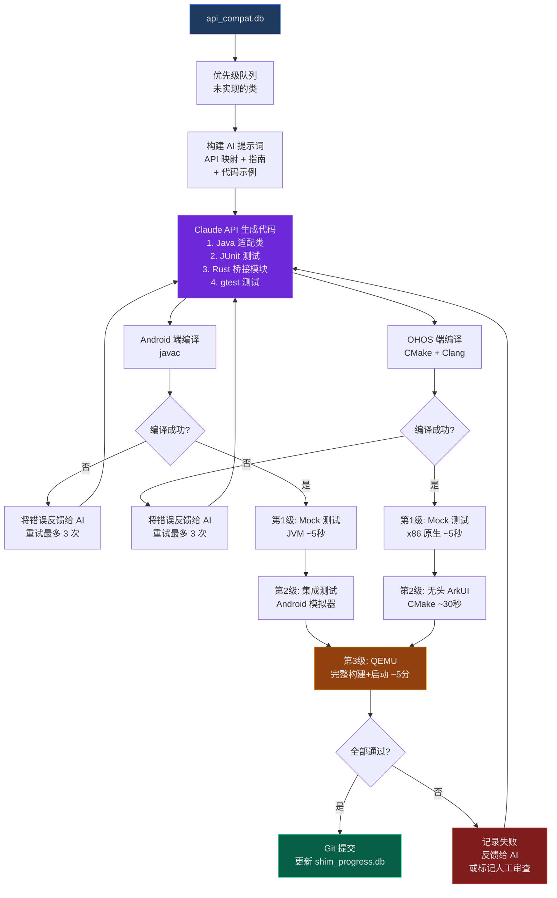
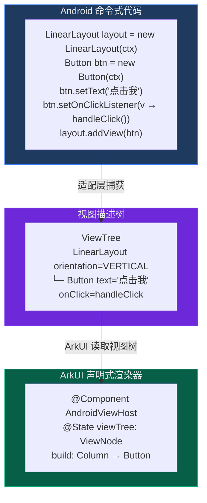

# API 适配层：AI 驱动构建计划

## 执行摘要

基于 AI 辅助代码生成，构建透明的 Android-to-OHOS API 翻译层。利用现有的 `api_compat.db`（57,289 个 Android API，含兼容性评分）、3 个 Android 测试应用、自动化 OHOS 构建+QEMU 测试环境、以及无头 ArkUI 测试基础设施。系统将迭代生成适配代码，在 Android 和 OHOS 双端编译测试，并将结果反馈以提升生成质量。

---

## 系统架构总览



### 适配层详细架构

```mermaid
graph TD
    APK["APK 字节码<br/>未修改的 .dex 文件"]

    subgraph L1["第一层：Java 适配层 (~3,105 行)"]
        direction LR
        APP["android.app.*<br/>Activity, Service<br/>Notification"]
        CONTENT["android.content.*<br/>Context, Intent<br/>SharedPreferences"]
        OS["android.os.*<br/>Bundle, Handler<br/>Looper"]
        VIEW["android.view.*<br/>View, ViewGroup<br/>LayoutInflater"]
        WIDGET["android.widget.*<br/>Button, TextView<br/>EditText, Toast"]
        NET["android.net.*<br/>Uri, HttpURL"]
    end

    subgraph L2["第二层：JNI/FFI 桥接层 (~2,658 行 Rust/C++)"]
        PREFS["preferences.rs<br/>SharedPreferences"]
        RDB["rdb_store.rs<br/>SQLiteDatabase"]
        NAV["navigation.rs<br/>Activity 生命周期"]
        NOTIF["notification.rs<br/>通知系统"]
        LOG["logging.rs<br/>Log → HiLog"]
        VBRIDGE["view.rs<br/>View 渲染"]
    end

    subgraph L3["第三层：OpenHarmony 原生 API"]
        direction LR
        DATA["@ohos.data.*<br/>preferences<br/>relationalStore"]
        ABILITY["@ohos.app.ability<br/>UIAbility"]
        OHNOTIF["@ohos.notification"]
        OHNET["@ohos.net.http"]
        MEDIA["@ohos.multimedia"]
        ARKUI["ArkUI<br/>声明式 UI"]
    end

    APK -->|"调用 android.*"| L1
    L1 -->|"JNI 调用"| L2
    L2 -->|"FFI 调用"| L3

    style APK fill:#1f2937,stroke:#6b7280,color:#e5e7eb
    style L1 fill:#1e3a5f,stroke:#3b82f6,color:#e5e7eb
    style L2 fill:#6d28d9,stroke:#7c3aed,color:#e5e7eb
    style L3 fill:#065f46,stroke:#10b981,color:#e5e7eb
```



---

## 现有资产清单

| 资产 | 描述 | 位置 |
|------|------|------|
| API 数据库 | 57,289 Android API + 29,290 OH API，含评分映射 | `database/api_compat.db` |
| 适配类 | 28+ Java 类（3,105 行） | `shim/java/android/` |
| JNI 桥接 | Rust + C++ 桥接层（2,658 行） | `shim/bridge/` |
| 后端 API | FastAPI + SQLite 查询系统 | `backend/` |
| 前端界面 | React 仪表盘，评分/工作量可视化 | `frontend/` |
| 测试应用 | FlashNote、无头 CLI、UI 原型 | `test-apps/` |
| 自动生成器 | 自进化适配循环脚本（416 行） | `a2oh-loop.sh` |
| ArkUI 测试 | 独立 CMake 构建，26 个按钮测试 ~3ms | `~/openharmony/arkui_test_standalone/` |
| OHOS 构建 | GN+Ninja，qemu-arm-linux-min 产品 | `~/openharmony/` |
| QEMU 运行时 | 提取的 qemu-system-arm，可启动镜像 | `~/openharmony/tools/qemu-extracted/` |
| 技能指南 | 11 份迁移技能文档 | `skills/` |

### API 分级概览

| 级别 | 评分 | 数量 | 百分比 | 映射类型 | 策略 |
|------|------|------|--------|----------|------|
| 第一级 | 8-10 | 7,457 | 13% | 直接/接近 | AI 生成，自动测试 |
| 第二级 | 5-7 | 14,777 | 26% | 部分/组合 | AI 生成+丰富上下文，人工审查 |
| 第三级 | 1-4 | 8,534 | 15% | 结构性差异 | UI 重写或 Dalvik 回退 |
| 无对应 | 0 | 26,521 | 46% | 无等效 API | 超出范围或 Dalvik 回退 |

---

## 阶段 0：基础设施加固（第 1 周）

### AI 生成与测试完整流程



### 0.1 — 端到端测试流水线验证

**目标：** 验证完整循环可运行：生成适配代码 -> Android 端编译 -> OHOS 端编译 -> 双端测试 -> 结果对比。

**任务：**

1. **验证现有 `run-local-tests.sh`** — 确认 `02-headless-cli` 和 `03-ui-mockup` 测试应用可正常编译通过
2. **验证 OHOS 构建** — 确认 `qemu-arm-linux-min` 构建成功，镜像可在 QEMU 中启动
3. **验证 ArkUI 无头测试** — 重新构建 `/tmp/arkui-test-build/`，确认 26 个按钮测试通过
4. **创建金丝雀测试** — 一个 SharedPreferences 往返测试，覆盖完整路径：Android 模拟 -> Java 适配类 -> JNI 桥接桩 -> OHOS 原生 API 模拟

### 0.2 — 统一测试工具

**目标：** 单一命令同时运行 Android 端和 OHOS 端测试，生成合并的通过/失败报告。

**创建 `test-harness/run-all.sh`：**

```
+---------------------------------------------+
|  run-all.sh                                 |
|                                             |
|  1. 编译适配 Java 类 (javac)                 |
|  2. 运行 Android 端无头测试 (JVM)            |
|  3. 构建 OHOS 原生测试二进制 (CMake)          |
|  4. 运行 OHOS 端测试 (x86 原生)              |
|  5. [可选] 构建 qemu-arm-linux-min           |
|  6. [可选] 启动 QEMU，设备端运行              |
|  7. 合并结果 -> JSON 报告                    |
|  8. 更新 shim_progress.db                   |
+---------------------------------------------+
```

**测试级别（通过 `--level` 选择）：**

- **第1级 — 纯 Mock**（~5 秒）：双端使用 Mock，无需真实平台。捕获编译错误、API 形状不匹配、基础逻辑错误。
- **第2级 — 原生无头**（~30 秒）：OHOS 端通过独立 CMake 编译真实 ace_engine 源码。捕获 ArkUI 集成问题。
- **第3级 — QEMU 集成**（~5 分钟）：完整构建 + QEMU 启动 + 设备端测试。捕获运行时/内核/初始化问题。

### 0.3 — 适配进度数据库增强

**扩展 `shim_progress.db` 模式以跟踪完整生成生命周期：**

```sql
CREATE TABLE shim_classes (
    android_class TEXT PRIMARY KEY,       -- Android 类全名
    shim_java_path TEXT,                  -- 生成的 Java 文件路径
    bridge_rust_path TEXT,                -- 桥接模块路径
    ohos_test_path TEXT,                  -- OHOS 端测试路径
    android_test_path TEXT,               -- Android 端测试路径
    generation_model TEXT,                -- 使用的 AI 模型
    generation_prompt_hash TEXT,          -- 提示词哈希
    api_count INTEGER,                    -- 本类适配的 API 数量
    test_count INTEGER,                   -- 测试用例数量
    android_test_pass BOOLEAN,            -- 最近 Android 端结果
    ohos_test_pass BOOLEAN,               -- 最近 OHOS 端结果
    ohos_qemu_pass BOOLEAN,               -- 最近 QEMU 集成结果
    iteration INTEGER DEFAULT 1,          -- AI 修复迭代次数
    status TEXT,                          -- draft|compiles|tests_pass|verified
    score_avg REAL,                       -- API 平均兼容性评分
    effort_level TEXT,                    -- 来自 api_compat.db
    created_at TIMESTAMP,
    updated_at TIMESTAMP
);

CREATE TABLE shim_apis (
    android_api_id INTEGER,               -- 外键 -> api_compat.db
    shim_class TEXT,                      -- 外键 -> shim_classes
    method_name TEXT,                     -- 方法名
    shimmed BOOLEAN,                      -- 是否已适配
    test_covered BOOLEAN,                 -- 是否有测试覆盖
    test_pass BOOLEAN,                    -- 测试是否通过
    notes TEXT                            -- 备注
);

CREATE TABLE generation_log (
    id INTEGER PRIMARY KEY,
    shim_class TEXT,                      -- 类名
    iteration INTEGER,                    -- 迭代次数
    prompt TEXT,                          -- 发送给 AI 的完整提示词
    response TEXT,                        -- AI 响应（代码）
    compile_stdout TEXT,                  -- 编译标准输出
    compile_stderr TEXT,                  -- 编译错误输出
    test_stdout TEXT,                     -- 测试标准输出
    test_stderr TEXT,                     -- 测试错误输出
    success BOOLEAN,                      -- 是否成功
    timestamp TIMESTAMP
);
```

---

## 阶段 1：第一级 — 直接映射（第 2-4 周）

### 目标：7,457 个评分 8-10 的 API（占总数 13%）

这些 API 具有几乎相同的语义。AI 生成应在首次或第二次尝试中成功。

### 1.1 — API 优先级队列

**查询 `api_compat.db` 构建生成队列：**

```sql
SELECT at.name as class_name,
       COUNT(*) as api_count,
       AVG(m.score) as avg_score,
       m.effort_level,
       GROUP_CONCAT(DISTINCT m.mapping_type) as types
FROM api_mappings m
JOIN android_apis aa ON m.android_api_id = aa.id
JOIN android_types at ON aa.type_id = at.id
WHERE m.score >= 8
  AND m.mapping_type IN ('direct', 'near')
  AND at.name NOT IN (/* 已适配的 34 个类 */)
GROUP BY at.name
ORDER BY api_count DESC, avg_score DESC;
```

**预计高优先级类（尚未适配）：**

| 优先级 | Android 类 | API 数量 | 平均评分 | OH 对应 |
|--------|-----------|----------|----------|---------|
| 1 | `android.util.Log` | 12 | 9.5 | `hilog` |
| 2 | `android.os.Handler` | 18 | 8.2 | `taskpool`/`EventRunner` |
| 3 | `android.os.Looper` | 8 | 8.0 | `EventRunner` |
| 4 | `android.graphics.Color` | 15 | 9.0 | ArkUI Color |
| 5 | `android.text.TextUtils` | 10 | 8.5 | TS 字符串工具 |
| 6 | `android.os.SystemClock` | 5 | 9.0 | `systemDateTime` |
| 7 | `android.util.SparseArray` | 12 | 8.0 | TS Map |
| 8 | `android.util.ArrayMap` | 15 | 8.0 | TS Map |

### 1.2 — AI 生成提示词模板（第一级）

每个类从 `api_compat.db` 数据构建结构化提示词：

```
你正在为 OpenHarmony 生成一个 Android API 适配类。

## 目标类：android.content.SharedPreferences

## API 映射（来自兼容性数据库）：
| Android 方法 | OH 对应 | 评分 | 映射类型 | 迁移指南 |
|---|---|---|---|---|
| getString(String, String) | preferences.get(key) | 9 | 直接 | 直接调用，类型转换返回值 |
| putString(String, String) | preferences.put(key, value) | 9 | 直接 | 直接调用 |
| getInt(String, int) | preferences.get(key) | 8 | 接近 | OH 返回字符串，需类型转换 |
| ...

## 已有适配代码（如更新）：
{shim/java/android/content/SharedPreferences.java 的内容}

## 已有桥接代码：
{shim/bridge/rust/src/preferences.rs 的内容}

## 约束条件：
- Java 适配类必须精确实现 android.content.SharedPreferences 接口
- 所有公共方法必须存在（即使用 TODO 桩代替）
- 桥接调用通过 OHBridge.nativeXxx() JNI 方法
- 必须可用 MockOHBridge 测试（无需真实 OH 运行时）

## 生成内容：
1. Java 适配类（完整，可编译）
2. 单元测试类（JUnit4，测试每个方法）
3. 桥接 Rust 模块（JNI 入口点）
4. OHOS 端测试（gtest，测试 OH API 调用）
```

### 1.3 — 生成循环（增强版 `a2oh-loop.sh`）

**增强现有 416 行脚本，加入错误反馈循环：**

```
+--------------------------------------------------+
|               AI 生成循环流程                      |
+--------------------------------------------------+
|                                                  |
|  对于优先级队列中的每个类：                         |
|                                                  |
|    1. 查询 api_compat.db 获取所有 API + 指南      |
|    2. 查询已有适配代码（如更新）                    |
|    3. 从模板构建提示词                             |
|    4. 调用 Claude API -> 获取 Java + 测试 + 桥接  |
|    5. 写入文件到 shim/ 和 test-apps/              |
|    6. 编译 (javac 编译 Java, cmake 编译 OHOS)     |
|       +-- 成功 -> 继续步骤 7                      |
|       +-- 失败 -> 将错误反馈给 AI                  |
|          +-- 重试（最多 3 次迭代）                 |
|    7. 运行 Android 端测试                         |
|       +-- 通过 -> 继续步骤 8                      |
|       +-- 失败 -> 将失败信息反馈给 AI              |
|          +-- 重试（最多 3 次迭代）                 |
|    8. 运行 OHOS 端测试（无头模式）                  |
|       +-- 通过 -> 继续步骤 9                      |
|       +-- 失败 -> 将失败信息反馈给 AI              |
|          +-- 重试（最多 3 次迭代）                 |
|    9. 更新 shim_progress.db                      |
|   10. GIT 提交（如全部通过）                       |
|                                                  |
|  报告：尝试数、通过数、失败数                       |
+--------------------------------------------------+
```

**相比现有 `a2oh-loop.sh` 的关键改进：** 错误反馈循环。当编译或测试失败时，错误输出附加到提示词中，AI 重新生成。这种自我修复循环是 AI 编码的核心价值 — AI 看到自己的错误并纠正，通常在 2-3 次迭代内收敛。

### 1.4 — 第一级测试应用：`04-tier1-validation`

**创建专门覆盖第一级 API 的新测试应用：**

```java
// test-apps/04-tier1-validation/src/Tier1Test.java
public class Tier1Test {
    // 组 1：数据存储
    void testSharedPreferences() { /* put/get/remove/clear */ }
    void testSQLiteDatabase() { /* CRUD 操作 */ }

    // 组 2：日志与工具
    void testLog() { /* Log.d/i/w/e 带标签 */ }
    void testTextUtils() { /* isEmpty, join, split */ }

    // 组 3：系统服务
    void testSystemClock() { /* elapsedRealtime, uptimeMillis */ }
    void testToast() { /* makeText, show */ }

    // 组 4：数据结构
    void testBundle() { /* put/get 各种类型 */ }
    void testUri() { /* parse, getScheme, getPath */ }
    void testIntent() { /* actions, extras, component */ }
}
```

### 1.5 — 预期产出（第一级）

| 指标 | 目标 |
|------|------|
| 适配类数量 | 50-80 |
| 覆盖 API 数 | ~5,000 / 7,457 |
| 测试覆盖率 | >90% 已适配 API |
| Android 端通过率 | >95% |
| OHOS Mock 通过率 | >90% |
| AI 平均迭代次数 | 1.5 次/类 |

---

## 阶段 2：第二级 — 组合映射（第 5-10 周）

### 目标：14,777 个评分 5-7 的 API（占总数 26%）

需要适配逻辑 — 参数重排、异步转同步、多 API 组合。AI 需要更丰富的上下文。

### 2.1 — 按子系统顺序生成

**按子系统处理第二级，逐步构建依赖的适配代码：**

| 顺序 | 子系统 | 关键类 | 复杂度 |
|------|--------|--------|--------|
| 1 | 操作系统/系统 | Handler, Looper, Message, Parcel | 中 — 事件循环模型不同 |
| 2 | 内容 | ContentResolver, ContentValues | 中 — DataShareHelper 映射 |
| 3 | 应用框架 | Activity（增强）, Service, BroadcastReceiver | 高 — 生命周期模型差异 |
| 4 | 网络 | HttpURLConnection, ConnectivityManager | 中 — @ohos.net.http |
| 5 | 多媒体 | MediaPlayer, AudioManager | 中 — @ohos.multimedia |
| 6 | 传感器 | SensorManager, SensorEvent | 中 — @ohos.sensor |
| 7 | 通知 | NotificationManager（增强）, Channels | 中 — 已部分适配 |
| 8 | 权限 | PermissionManager, checkSelfPermission | 中 — @ohos.abilityAccessCtrl |
| 9 | 蓝牙 | BluetoothAdapter, BluetoothDevice | 难 — 发现模型不同 |
| 10 | 电话 | TelephonyManager, SmsManager | 难 — @ohos.telephony |

### 2.2 — 增强提示词模板（第二级）

第二级提示词包含额外上下文：

```
## 范式差异：
- Android 使用同步回调；OH 使用异步 Promise
- Android ContentProvider 使用基于 URI 的 CRUD；OH 使用 DataShareHelper
- Android Handler/Looper 基于线程；OH 使用 TaskPool/EventRunner

## 已适配的依赖项：
{此类可调用的第一级适配列表}

## 来自 api_compat.db 的代码示例：
### Android：
{映射中的 code_example_android}

### OpenHarmony：
{映射中的 code_example_oh}

## 已知差异（来自 gap_description）：
{每个 API 的 gap_description 字段}

## 策略：
- 异步差异：将 OH Promise 包装为阻塞 Future，提供 Android 兼容的同步 API
- 缺失参数：提供合理默认值，记录在 migration_guide 中
- 多调用组合：在 OHBridge 中生成辅助方法
```

### 2.3 — 组合测试应用

**扩展测试应用以覆盖跨类交互：**

```
test-apps/05-tier2-lifecycle/
  +-- TestActivity.java          # Activity 生命周期测试
  +-- TestService.java           # Service 生命周期测试
  +-- TestBroadcastReceiver.java # 广播测试

test-apps/06-tier2-networking/
  +-- HttpTest.java              # HTTP GET/POST
  +-- ConnectivityTest.java      # 网络状态
  +-- SocketTest.java            # TCP/UDP

test-apps/07-tier2-media/
  +-- MediaPlayerTest.java       # 音频播放
  +-- AudioRecordTest.java       # 录音
  +-- AudioManagerTest.java      # 音量/路由
```

### 2.4 — QEMU 集成测试（第3级）

对于第二级 API，Mock 测试不够充分 — 某些行为只在真实 OHOS 运行时中体现。

**QEMU 测试运行流程：**

```
+--------------------------------------------------+
|            QEMU 集成测试流程                       |
+--------------------------------------------------+
|                                                  |
|  1. 构建 qemu-arm-linux-min（含测试二进制文件）     |
|     |                                            |
|     v                                            |
|  2. 启动 QEMU                                    |
|     - virtio-mmio 驱动顺序（反向枚举）：           |
|       userdata, vendor, system, updater          |
|     - vda=updater, vdb=system, vdc=vendor,       |
|       vdd=userdata                               |
|     |                                            |
|     v                                            |
|  3. 等待 init 达到多用户目标                       |
|     - 超时时间：120 秒                             |
|     |                                            |
|     v                                            |
|  4. 通过串口控制台执行测试                          |
|     - 或通过 HDC 推送测试二进制文件                 |
|     |                                            |
|     v                                            |
|  5. 捕获 stdout/stderr                           |
|     - 解析 gtest XML 输出                         |
|     |                                            |
|     v                                            |
|  6. 关闭 QEMU                                    |
|     |                                            |
|     v                                            |
|  7. 合并结果到 shim_progress.db                   |
|                                                  |
+--------------------------------------------------+
```

**QEMU 环境约束（来自前期工作）：**
- system.img 不能有 ext4 64bit 特性（32 位 ARM 内核限制）
- 使用 `mke2fs -t ext4 -b 4096 -I 256 -O ^64bit,^metadata_csum` 重建镜像
- 必须使用预构建 Python 3.10，不能用系统 Python 3.13

---

## 阶段 3：UI 层 — ArkUI 适配（第 11-18 周）

### 目标：View/Widget API（评分 1-4，~4,700 个 API）

这是最难的级别。Android 命令式 `View` 系统无法直接映射到 ArkUI 声明式模型。策略：**编译时翻译，而非运行时适配**。

### 3.1 — 策略：声明式视图构建器



### 3.2 — 无头 ArkUI 测试用于视图适配验证

**利用现有 `arkui_test_standalone/` 基础设施：**

为每个适配的 Android 组件创建对应的 ArkUI 测试，验证声明式输出与预期渲染行为匹配。

**扩展 CMakeLists.txt 添加新测试目标：**

```cmake
# 新目标：view_shim_test_ng
add_executable(view_shim_test_ng
    ${VIEW_SHIM_TEST_SRCS}    # 我们的自定义测试
    ${ACE_BASE_SRCS}
    ${ACE_COMPONENTS_BASE_SRCS}
    # ... 与 button_test_ng 相同的框架源文件
    ${ACE_MOCK_SRCS}
    ${LINKER_STUBS}
)
```

**待添加的测试用例（使用 `/arkui-test-add` 技能模式）：**

| Android 组件 | ArkUI 组件 | 测试文件 | 测试数 |
|-------------|-----------|---------|--------|
| Button | Button | `view_shim_button_test.cpp` | 15+ |
| TextView | Text | `view_shim_text_test.cpp` | 20+ |
| EditText | TextInput | `view_shim_textinput_test.cpp` | 15+ |
| ImageView | Image | `view_shim_image_test.cpp` | 10+ |
| LinearLayout | Column/Row | `view_shim_flex_test.cpp` | 12+ |
| FrameLayout | Stack | `view_shim_stack_test.cpp` | 8+ |
| ScrollView | Scroll | `view_shim_scroll_test.cpp` | 10+ |
| RecyclerView | List/LazyForEach | `view_shim_list_test.cpp` | 15+ |
| CheckBox | Checkbox | `view_shim_checkbox_test.cpp` | 8+ |
| Switch | Toggle | `view_shim_toggle_test.cpp` | 8+ |
| ProgressBar | Progress | `view_shim_progress_test.cpp` | 6+ |
| Spinner | Select | `view_shim_select_test.cpp` | 8+ |

**每个测试验证：**

1. 使用正确属性创建组件
2. 属性传播（文本、颜色、大小、内边距、外边距）
3. 事件处理器绑定（onClick、onTouch、onFocus）
4. 布局约束行为（width、height、weight、gravity -> flexGrow、alignSelf）
5. 视图层级（addView/removeView -> 组件树操作）

**无头测试关键约束（来自现有设置）：**
- `ENABLE_ROSEN_BACKEND` 不能定义（会引入 v1 Skia 代码路径）
- Skia 头文件使用桩文件（~60 个文件），非真实实现
- `linker_stubs.cpp` 为未使用的模式提供空实现
- 生成的主题代码在 `/tmp/` 清理后必须重新生成
- 构建输出在 `/tmp/arkui-test-build/` 中，重启后丢失

### 3.3 — View 属性映射表

**AI 生成这些映射；测试验证它们：**

| Android 属性 | ArkUI 属性 | 转换方式 |
|-------------|-----------|---------|
| `view.setWidth(dp)` | `.width(vp)` | dp 到 vp（标准密度 1:1） |
| `view.setPadding(l,t,r,b)` | `.padding({left,top,right,bottom})` | 直接映射 |
| `view.setBackgroundColor(c)` | `.backgroundColor(c)` | Color int 到 `#AARRGGBB` |
| `view.setVisibility(GONE)` | `.visibility(Visibility.None)` | 枚举映射 |
| `view.setVisibility(INVISIBLE)` | `.visibility(Visibility.Hidden)` | 枚举映射 |
| `view.setVisibility(VISIBLE)` | `.visibility(Visibility.Visible)` | 枚举映射 |
| `view.setAlpha(f)` | `.opacity(f)` | 直接映射 |
| `view.setElevation(f)` | `.shadow({radius:f})` | 近似映射 |
| `view.setEnabled(b)` | `.enabled(b)` | 直接映射 |
| `layout.setOrientation(V)` | `Column()` | 结构性 — 不同容器 |
| `layout.setOrientation(H)` | `Row()` | 结构性 — 不同容器 |
| `layout.setGravity(CENTER)` | `.justifyContent(FlexAlign.Center)` | 枚举映射 |
| `view.setOnClickListener` | `.onClick(callback)` | 包装回调 |
| `view.setOnLongClickListener` | `.gesture(LongPressGesture)` | 不同手势模型 |
| `text.setTextSize(sp)` | `.fontSize(fp)` | sp 到 fp |
| `text.setTextColor(c)` | `.fontColor(c)` | Color int 到 ArkUI 颜色 |
| `text.setTypeface(BOLD)` | `.fontWeight(FontWeight.Bold)` | 枚举映射 |
| `text.setMaxLines(n)` | `.maxLines(n)` | 直接映射 |
| `editText.setHint(s)` | `.placeholder(s)` | 直接映射 |
| `image.setScaleType(FIT)` | `.objectFit(ImageFit.Contain)` | 枚举映射 |
| `image.setScaleType(CROP)` | `.objectFit(ImageFit.Cover)` | 枚举映射 |
| `recycler.setAdapter(a)` | `List() { LazyForEach(dataSource) }` | 范式转换 |
| `checkbox.setChecked(b)` | `Checkbox({select: b})` | 构造参数 |
| `switch.setChecked(b)` | `Toggle({isOn: b})` | 构造参数 |
| `progress.setProgress(n)` | `Progress({value: n})` | 构造参数 |

### 3.4 — 布局算法验证

**关键：** 布局是 Android-ArkUI 差异导致实际 Bug 的地方。

**布局对比测试矩阵：**

| 布局场景 | Android | ArkUI 等效 | 验证项 |
|---------|---------|----------|--------|
| 垂直堆叠，等权重 | LinearLayout(V) + weight=1 | Column() + flexGrow(1) | 尺寸一致 |
| 水平换行 | FlexboxLayout(WRAP) | Flex({wrap: FlexWrap.Wrap}) | 换行行为 |
| 居中子元素 | FrameLayout + gravity=CENTER | Stack() + align(Alignment.Center) | 位置一致 |
| 外边距合并 | 两个带 margin 的视图 | 两个带 margin 的组件 | 间距一致 |
| match_parent + padding | match_parent + padding | .width('100%') + .padding() | 内容区一致 |
| 滚动视图 | ScrollView > LinearLayout | Scroll() > Column() | 滚动行为 |
| 大列表 | RecyclerView + Adapter | List() + LazyForEach | 可见项一致 |

**自动化对比：**

```
Android 端：在 Android 模拟器中运行，捕获布局转储
OHOS 端：运行无头 ArkUI 测试，读取 LayoutWrapper::GetGeometryNode()->GetFrameSize()
对比：像素级比较（容差 +/-1px）
```

---

## 阶段 4：桥接层加固（第 12-16 周，与阶段 3 并行）

### 4.1 — Rust 桥接模块生成

**为每个适配类，AI 生成 Rust JNI 桥接模块：**

```
shim/bridge/rust/src/
+-- lib.rs              # JNI 注册
+-- preferences.rs      # SharedPreferences <-> Preferences
+-- rdb_store.rs        # SQLiteDatabase <-> RdbStore
+-- handler.rs          # 新：Handler <-> EventRunner
+-- connectivity.rs     # 新：ConnectivityManager <-> @ohos.net.connection
+-- media_player.rs     # 新：MediaPlayer <-> @ohos.multimedia.media
+-- sensor.rs           # 新：SensorManager <-> @ohos.sensor
+-- bluetooth.rs        # 新：BluetoothAdapter <-> @ohos.bluetooth
+-- view_bridge.rs      # 新：ViewTree 序列化 <-> ArkUI
+-- ...
```

**每个模块必须处理：**

- JNI 类型编排（jobject <-> Rust 结构体 <-> OH C 类型）
- 异步转同步（OH Promise -> 阻塞式 JNI 返回）
- 错误翻译（OH 错误码 -> Java 异常）
- 生命周期管理（JNI 全局/局部/弱引用跟踪）
- 线程安全（JNI env 是线程本地的，OH API 可能需要主线程）

### 4.2 — 类型编排测试矩阵

**对每种 JNI 类型转换进行自动化测试：**

| Java 类型 | JNI 类型 | Rust 类型 | OH C 类型 | 测试用例 |
|-----------|----------|-----------|-----------|---------|
| `String` | `jstring` | `String` | `char*` | 往返 "hello"、"你好"、空、null |
| `int` | `jint` | `i32` | `int32_t` | INT_MIN, -1, 0, 1, INT_MAX |
| `long` | `jlong` | `i64` | `int64_t` | LONG_MIN, 0, LONG_MAX |
| `float` | `jfloat` | `f32` | `float` | 0.0, -0.0, NaN, Inf |
| `double` | `jdouble` | `f64` | `double` | 同上边界用例 |
| `boolean` | `jboolean` | `bool` | `bool` | true, false |
| `byte[]` | `jbyteArray` | `Vec<u8>` | `uint8_t*` | 空、1字节、1MB、二进制 |
| `Bundle` | `jobject` | `HashMap` | `OH_Want*` | 嵌套、所有值类型 |
| `null` | `NULL` | `Option::None` | `nullptr` | 每种类型的 null 安全 |

---

## 阶段 5：持续验证与回归（第 8 周起，持续进行）

### 5.1 — 回归测试套件

```
test-harness/
+-- run-all.sh                    # 主运行器
+-- android-side/
|   +-- tier1-tests/              # 50+ JUnit 测试类
|   +-- tier2-tests/              # 30+ JUnit 测试类
|   +-- ui-tests/                 # View 适配测试
+-- ohos-side/
|   +-- headless/                 # 独立 CMake 测试
|   |   +-- CMakeLists.txt        # 扩展 arkui_test_standalone
|   |   +-- data_shim_test.cpp    # Preferences, RDB
|   |   +-- lifecycle_test.cpp    # Activity -> UIAbility
|   |   +-- network_test.cpp      # HTTP, 连接性
|   |   +-- view_shim_test.cpp    # ArkUI 组件验证
|   +-- qemu/                     # QEMU 集成测试
|       +-- qemu-test-runner.sh
|       +-- on-device-tests/
+-- comparison/
|   +-- layout_compare.py         # 布局像素对比
|   +-- behavior_compare.py       # API 行为对比
+-- reports/
    +-- coverage.html             # API 测试覆盖
    +-- pass-rate.html            # 通过率趋势
    +-- regression.html           # 新增失败项
```

### 5.2 — CI 循环（每夜构建）

```
+-----------------------------------------------------+
|  每夜 CI 流程                                        |
|                                                     |
|  1. 拉取最新 api_compat.db 更新                      |
|  2. AI 生成下一批未适配的类                            |
|  3. 编译所有适配代码（Android + OHOS）                 |
|  4. 运行第1级测试（Mock，~30 秒）                     |
|  5. 运行第2级测试（无头 ArkUI，~2 分钟）               |
|  6. 运行第3级测试（QEMU，~10 分钟）                   |
|  7. 更新 shim_progress.db                           |
|  8. 生成覆盖率报告                                    |
|  9. 提交通过的适配代码                                 |
| 10. 为需要人工审查的失败项创建 Issue                    |
+-----------------------------------------------------+
```

### 5.3 — 覆盖率跟踪仪表盘

**扩展现有 FastAPI 后端，添加新端点：**

```
GET /api/shim/progress          # 适配整体完成度
GET /api/shim/coverage          # 按子系统 API 覆盖率
GET /api/shim/test-results      # 测试通过/失败历史
GET /api/shim/blockers          # 超过 3 次 AI 迭代仍失败的 API
GET /api/shim/quality           # 已适配与未适配的评分分布
```

**仪表盘指标：**

- 已适配 API 总数 / Android API 总数（目标：54% = 第一级 + 第二级）
- 测试通过率（目标：第一级 >95%，第二级 >85%）
- AI 生成成功率（首次尝试 vs. 需要重试）
- 需要人工干预的 API（评分 <5，失败 >3 次迭代）
- 成本跟踪：每个类消耗的 token 数，每个 API 的适配成本

---

## 阶段 6：真实应用验证（第 16-20 周）

### 6.1 — FlashNote 应用（已手动转换）

**用作回归基准：**

- FlashNote 的所有 API 应被第一级/第二级适配覆盖
- 通过适配层运行 FlashNote，而非手动转换
- 与 `test-apps/01-flashnote/openharmony/` 中手动转换的 OHOS 版本对比行为
- 成功标准：功能行为完全一致（数据持久化、提醒、通知）

### 6.2 — 新验证应用（递增复杂度）

| 应用 | 使用的 Android API | 级别分布 | 目的 |
|------|-------------------|---------|------|
| **待办应用** | SQLite, RecyclerView, SharedPrefs, Notifications | 70% T1, 30% T2 | 基础 CRUD + UI |
| **天气应用** | HTTP, JSON, ListView, AsyncTask, Location | 40% T1, 50% T2, 10% T3 | 网络 + 定位 |
| **聊天应用** | WebSocket, RecyclerView, Camera, FileProvider | 20% T1, 50% T2, 30% T3 | 实时 + 多媒体 |
| **地图应用** | MapView, Location, Sensors, Custom drawing | 10% T1, 30% T2, 60% T3 | 第三级压力测试 |

### 6.3 — 行为等价性测试

**非 UI API：**

```
1. 运行 Android 应用操作 -> 捕获 API 调用跟踪 + 返回值
2. 通过适配层在 OHOS 上运行相同操作 -> 捕获相同跟踪
3. 对比跟踪：相同调用？相同返回？相同副作用？
4. 报告行为差异
```

**UI API：**

```
1. 运行 Android 布局 -> 捕获视图层级 + 测量值
2. 运行 ArkUI 等效 -> 捕获组件树 + 测量值
3. 对比：相同结构？相同尺寸（容差内）？相同事件处理？
```

**等价性分类：**

| 类别 | 定义 | 可接受偏差 |
|------|------|-----------|
| **精确** | 完全相同的返回值和副作用 | 无 |
| **语义** | 相同可观察行为，不同内部实现 | 内部状态可不同 |
| **近似** | 接近但不完全相同（如布局取整） | +/-1px, +/-1ms |
| **行为** | 相同用户可见结果，不同执行路径 | 异步顺序可能不同 |
| **已知差异** | 已知限制，行为已记录 | 必须在 known_limitations.json 中 |

---

## 阶段 7：优化与生产就绪（第 20-24 周）

### 7.1 — 性能分析

- 测量每个 API 调用的适配开销（目标：直接映射 <1ms）
- 识别热点路径（高频调用 API）并优化
- JNI 调用减少（尽可能批量操作）
- 内存分析：确保无 JNI 引用泄漏

### 7.2 — 错误处理加固

**错误映射表：**

| OH 错误 | Java 异常 | 上下文 |
|---------|----------|--------|
| `ERR_PERMISSION_DENIED` | `SecurityException` | 缺少 OHOS 权限 |
| `ERR_INVALID_PARAM` | `IllegalArgumentException` | 参数错误 |
| `ERR_NOT_FOUND` | `FileNotFoundException` | 资源不存在 |
| `ERR_NO_MEMORY` | `OutOfMemoryError` | 内存耗尽 |
| `ERR_TIMEOUT` | `TimeoutException` | 操作超时 |
| `ERR_IO` | `IOException` | I/O 失败 |

### 7.3 — 打包交付

```
android-ohos-shim/
+-- shim.jar                    # 所有 Java 适配类
+-- libshim_bridge.so           # Rust/C++ 桥接（ARM）
+-- libshim_bridge_x86.so       # x86 测试用
+-- ohos_adapters/              # ArkUI 适配组件
|   +-- AndroidViewHost.ets     # 视图树渲染器
|   +-- AndroidActivity.ets     # Activity 生命周期适配器
|   +-- ...
+-- config/
    +-- api_coverage.json       # 已适配 API 列表
    +-- known_limitations.json  # 行为差异说明
    +-- error_mappings.json     # OH 错误 -> Java 异常映射
```

---

## 成功指标

| 里程碑 | 目标 | 衡量方式 |
|--------|------|---------|
| 阶段 0 完成 | 流水线端到端可运行 | 金丝雀测试在所有3级通过 |
| 阶段 1 完成 | 5,000+ 第一级 API 已适配 | `shim_progress.db` 计数 |
| 阶段 2 完成 | 10,000+ 第二级 API 已适配 | `shim_progress.db` 计数 |
| 阶段 3 完成 | 20+ Android 组件可通过 ArkUI 渲染 | 无头 ArkUI 测试通过 |
| 阶段 4 完成 | 桥接层可编译为 ARM 目标 | 交叉编译成功 |
| 阶段 5 完成 | 所有级别 >90% 测试通过率 | 每夜 CI 报告 |
| 阶段 6 完成 | FlashNote 可通过适配层运行 | 行为等价性验证 |
| 阶段 7 完成 | 每次适配调用开销 <1ms | 性能基准测试 |

**总体目标：** ~25,000 个 API 已适配（占总数 44%），覆盖代表典型应用 >80% 使用率的第一级 + 第二级 API。剩余 46%（无 OH 对应的第三级）需要应用级重写或 Dalvik VM 回退（记录在 `skills/DALVIK-PORT.md` 中）。

---

## 风险缓解

| 风险 | 影响 | 缓解措施 |
|------|------|---------|
| AI 生成错误映射 | 运行时行为错误 | 三级测试（Mock、无头、QEMU）捕获错误 |
| ArkUI 属性模型与 Android View 差异 | UI 渲染不一致 | 带像素容差的布局对比测试 |
| JNI 桥接内存泄漏 | 应用崩溃/OOM | JNI 引用跟踪 + x86 测试使用 valgrind |
| OH API 版本间破坏性变更 | 适配层失效 | 版本锁定 OH SDK，跟踪 API 稳定性 |
| 第三级 API 阻碍实际应用采用 | 应用兼容性受限 | 不支持 API 使用 Dalvik VM 回退 |
| QEMU 启动不稳定 | 集成测试不稳定 | 超时 + 重试 + 回退到第2级测试 |
| `/tmp/` 丢失构建产物 | 重建开销 | 在持久目录缓存产物 |

---

## 附录 A：已适配类（34 个）

来自现有 `a2oh-loop.sh` 排除列表：

- `android.app.Activity`, `Application`, `NotificationManager`, `NotificationChannel`, `Notification`, `AlarmManager`, `PendingIntent`
- `android.content.Context`, `Intent`, `SharedPreferences`, `BroadcastReceiver`, `ContentValues`
- `android.os.Build`, `Bundle`
- `android.database.Cursor`, `CursorWrapper`, `SQLException`
- `android.database.sqlite.SQLiteDatabase`, `SQLiteOpenHelper`
- `android.view.View`, `ViewGroup`, `LayoutInflater`, `Gravity`
- `android.widget.Toast`, `TextView`, `Button`, `EditText`, `ImageView`
- `android.net.Uri`
- `android.util.Log`

## 附录 B：子系统兼容性评分

| 子系统 | API 数量 | 平均评分 | 覆盖率 | 优先级 |
|--------|---------|---------|--------|--------|
| Java 标准库 | 13,613 | 4.96 | ~50% | 中 |
| 图形 | 5,299 | 5.36 | ~54% | 中 |
| ICU | 4,191 | 3.57 | ~36% | 低 |
| 多媒体 | 4,118 | 3.19 | ~32% | 中 |
| 电话 | 2,855 | 2.64 | ~26% | 低 |
| 应用框架 | 2,823 | 3.53 | ~35% | 高 |
| 视图 | 2,748 | 2.11 | ~21% | 关键（第三级） |
| 核心 | 2,613 | 1.24 | ~12% | 低 |
| 组件 | 1,983 | 2.36 | ~24% | 关键（第三级） |
| Provider | 1,884 | 1.92 | ~19% | 中 |
| 操作系统 | 1,737 | 4.20 | ~42% | 高 |
| 内容 | 1,266 | 3.47 | ~35% | 高 |
| 文本 | 1,254 | 2.81 | ~28% | 中 |
| 蓝牙 | 884 | 3.19 | ~32% | 低 |
| 包管理器 | 836 | 2.40 | ~24% | 低 |

## 附录 C：可用 ArkUI 测试模式（86+）

`foundation/arkui/ace_engine/test/unittest/core/pattern/` 中有测试文件的组件：

animator, app_bar, badge, blank, bubble, button, calendar, calendar_picker, canvas_renderer, checkbox, checkboxgroup, common_view, container_modal, counter, custom, custom_paint, data_panel, dialog, divider, flex, folder_stack, form, gauge, grid, grid_col, grid_container, grid_row, hyperlink, image, image_animator, indexer, linear_layout, linear_split, list, loading_progress, marquee, menu, navigation, navigator 以及其他 47+ 组件。

可通过 `arkui_test_standalone/` 模式（独立 CMake 构建、Mock 基础设施、Skia 桩、链接器桩）为阶段 3 UI 验证提供支持。
